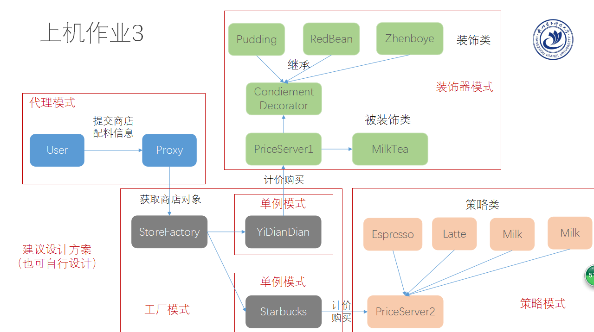

# Design-Patterns
Java实现软件工程设计模式

具体代码看这个仓库：
[21种设计模式Java实现详细代码](http://www.cnblogs.com/java-my-life/archive/2012/04/13/2442795.html)

> * 适配器模式（Adapter）
> * 工厂模式（Singleton）
> * 代理模式（Proxy）
> * 单例模式（Singleton）
> * 装饰器模式（Decorator）
> * 策略模式（Strategy）

### 适配器模式

适配器模式把一个类的接口变换成客户端所期待的另一种接口，从而使原本因接口不匹配而无法在一起工作的两个类能够在一起工作。

适配器模式的用意是要改变源的接口，以便于目标接口相容。

[详细介绍](http://www.cnblogs.com/java-my-life/archive/2012/04/13/2442795.html)

### 工厂模式

工厂模式属于创建型设计模式，它提供了一种创建对象的最佳方式。

定义：定义了一个创建产品对象的工厂接口，将实际创建工作推迟到子类工厂当中。

[详细介绍](https://www.cnblogs.com/chenxkang/p/6689631.html)

### 代理模式

代理模式是一种使用代理对象来执行目标对象的方法并在代理对象中增强目标对象方法的一种设计模式。

[详细介绍](https://www.cnblogs.com/chentingk/p/6433372.html)

### 单例模式

单例模式，是一种常用的软件设计模式。在它的核心结构中只包含一个被称为单例的特殊类。通过单例模式可以保证系统中，应用该模式的类一个类只有一个实例。即一个类只有一个对象实例。

[详细介绍](http://www.runoob.com/design-pattern/singleton-pattern.html)

### 装饰器模式

装饰器模式是一种用于代替继承的技术，无需通过继承增加子类就能扩展对象的新功能。使用对象的关联关系代替继承关系，更加灵活，同时避免类型体系的快速膨胀。

[详细介绍](https://www.cnblogs.com/jzb-blog/p/6717349.html)

### 策略模式

在策略模式中，一个类的行为或其算法可以在运行时更改。这种类型的设计模式属于行为型模式。

[详细介绍](http://www.runoob.com/design-pattern/strategy-pattern.html)

### 杭电软件工程设计模式上机 -- JAVA实现

